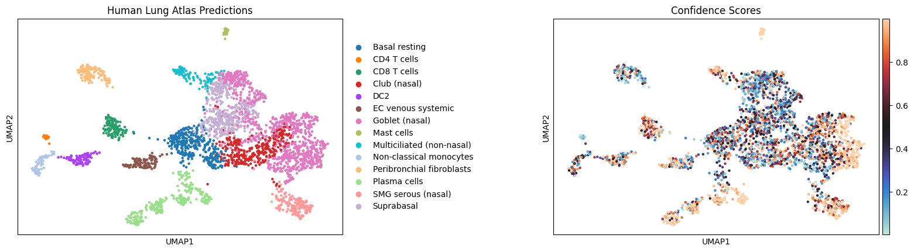
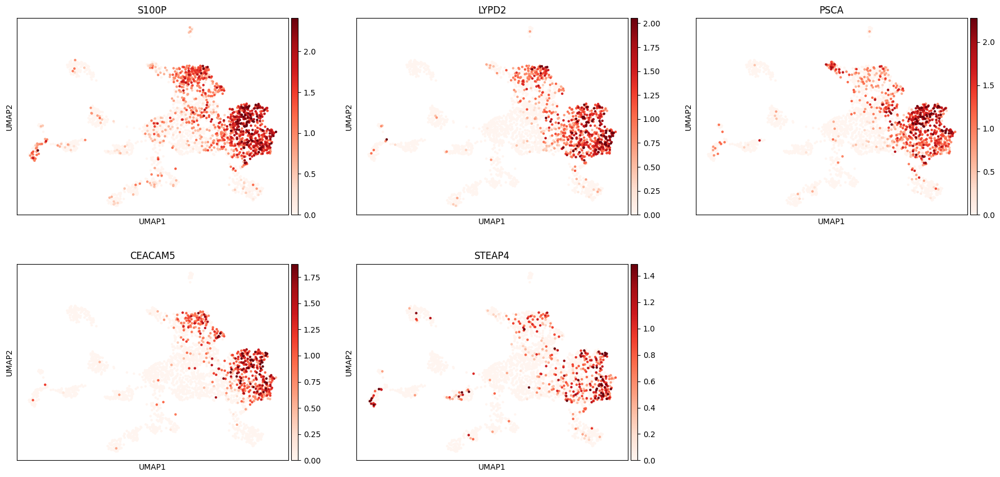
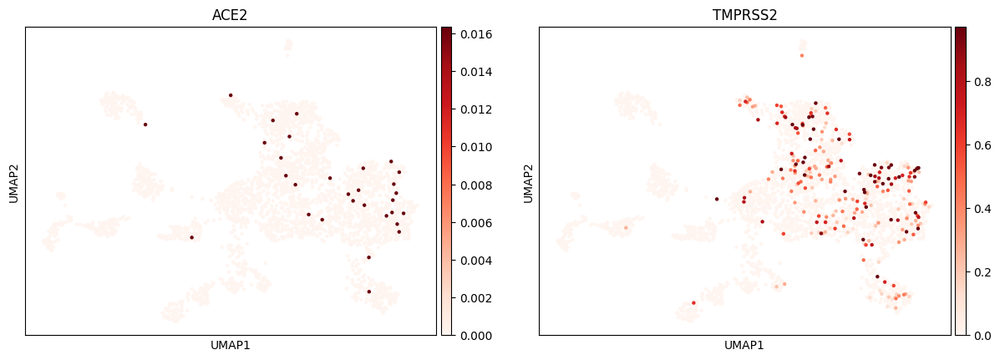

# sars_cov2_scRNA

## Background

The identification of **angiotensin-converting enzyme 2 (ACE2)** as the receptor for **SARS-CoV-2** underscores the critical importance of identifying the cellular landscape of ACE2 expression. This receptor-ligand interaction is central to the initial stages of viral infection, where binding of the viral spike protein to ACE2 results in receptor-mediated internalization, facilitating viral entry into host cells. Complementarily, the **major host protease TMPRSS2** plays a critical role in mediating spike protein activation on primary target cells. However, despite the understanding of these molecular interactions, the specific cell subsets expressing ACE2 in different tissues remain elusive. Identifying the cell subsets targeted by SARS-CoV-2, characterized by ACE2 expression, and those at greatest risk of direct infection, characterized by co-expression of ACE2 and TMPRSS2, is paramount to understanding viral pathogenesis and host defense mechanisms.

Motivated by this need, this project utilizes existing single-cell RNA sequencing datasets from the human upper respiratory tract, with a focus on the mucosa of the inferior turbinate and ethmoid sinuses. These datasets include a spectrum of samples from healthy donors to individuals with allergic inflammation due to chronic rhinosinusitis (CRS), providing a comprehensive view of the cellular landscape in both normal and inflammatory conditions. By analyzing these datasets, I aimed to reproduce some of the findings of the original study by Ziegler et al. to shed light on the cellular susceptibility to SARS-CoV-2 infection.

## Data and Preprocessing

The data used in this project comes from human upper airway tissue, specifically the inferior turbinate and ethmoid sinus mucosa. It was obtained from the Broad Institute's Single Cell Portal with the accession number SCP253.
To manage the large dataset within available computational resources, the original dataset containing 45,101 barcodes was downsampled to 3,000 barcodes. This reduction was a crucial step to enable further analysis without overwhelming computational capacity.
Quality control (QC) indicated that the data was of excellent quality (**Fig. 1**)), suggesting it was prefiltered by the original authors. Only slight adjustments were necessary, including filtering out barcodes with more than 40% mitochondrial gene expression. This adjustment was made because the analysis focuses on epithelial cells, which generally have lower metabolic activity. Additionally, doublet detection suggested only three possible doublets, which were disregarded due to their minimal impact on the dataset's overall quality.

  

**Figure 1: Violin plots of quality control metrics.** total_counts = total UMI counts found per barcode; n_genes_by_counts = number of genes detected per barcode based on UMI counts; pct_counts_mt = percentage of mitochondrial genes relative to total genes detected per barcode.

## Feature selection, dimensionality reduction, clustering, and cell annotation

Seurat was employed to identify the most variable genes within the dataset. This set of highly variable genes was then used to construct a Principal Component Analysis (PCA), enabling dimensionality reduction from the original large dataset.
Based on the first 30 principal components derived from the PCA, a neighborhood graph was constructed, serving as the foundation for subsequent analyses, including Uniform Manifold Approximation and Projection (UMAP).
The reduced-dimension UMAP was thoroughly examined to ensure there were no quality control issues. The inspection of QC parameters revealed no obvious problems, indicating that the dataset was suitable for clustering and further analysis.
Clustering was performed using the Leiden algorithm. The optimal resolution was determined to be 0.25, providing a balance between the number of clusters and the granularity of the analysis.
For cell annotation, Celltypist was used with the "Human_Lung_Atlas" model to categorize the clusters identified by the Leiden algorithm. This automated annotation process yielded several confidently annotated clusters, including Mast cells, multiciliated cells, CD8 T cells, plasma cells, submucosal gland cells (SMG), and goblet cells (**Fig. 2**). These annotations were consistent with the expected cell types and aligned well with the results from the original publication.

  

**Figure 2: UMAP projection of 3000 subsampled cells from human upper respiratory tract tissues including inferior turbinate and ethmoid sinus.** Cell type annotation by Celltypist using the Human Lung Atlas model (left panel). Confidence scores of the prediction (right panel).

## Marker genes

Marker genes play a crucial role in confirming cell type annotations and providing insights into specific biological processes. In this project, several marker genes were used to confirm the annotation of goblet cells and to investigate the expression of genes associated with SARS-CoV2 entry points.
To confirm the annotation of goblet cells, the following marker genes were analyzed: S100P, LYPD2, PSCA, CEACAM5, and STEAP4. These genes are well-established markers for goblet cells, and their expression pattern within the UMAP corresponded to the expected cluster (**Fig. 3**). This observation provided additional evidence that the correct cell type annotation had been achieved for this key cluster.

  

**Figure 3: UMAP projections of 5 marker genes for nasal goblet cells.**

In addition, the expression of two critical genes related to SARS-CoV2 entry was examined: ACE2 and TMPRSS2. The expression of these genes was sparse across the dataset, consistent with previous reports. However, when visualized on the UMAP, the few cells expressing ACE2 and TMPRSS2 tended to cluster within the region associated with nasal goblet cells (**Fig. 4**). This finding supports the hypothesis that goblet cells in the nasal region are potential entry points for SARS-CoV2, providing valuable insights into the initial stages of the virus's infection pathway.

  

**Figure 4: UMAP projections highlighting the SARS-CoV2 cell entry associated genes ACE2 and TMPRSS2.**

