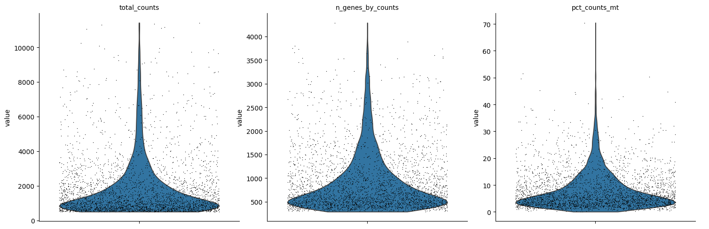

# sars_cov2_scRNA

## Data and Preprocessing

The data used in this project comes from human upper airway tissue, specifically the inferior turbinate and ethmoid sinus mucosa. It was obtained from the Broad Institute's Single Cell Portal with the accession number SCP253.
To manage the large dataset within available computational resources, the original dataset containing 45,101 barcodes was downsampled to 3,000 barcodes. This reduction was a crucial step to enable further analysis without overwhelming computational capacity.
Quality control (QC) indicated that the data was of excellent quality (**Fig. 1**)), suggesting it was prefiltered by the original authors. Only slight adjustments were necessary, including filtering out barcodes with more than 40% mitochondrial gene expression. This adjustment was made because the analysis focuses on epithelial cells, which generally have lower metabolic activity. Additionally, doublet detection suggested only three possible doublets, which were disregarded due to their minimal impact on the dataset's overall quality.

